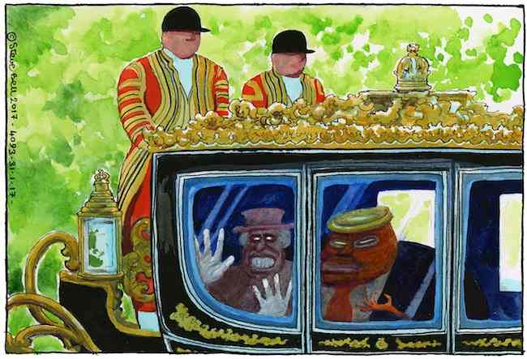

# Go Functional

Go Functional provides a Go package called `functional`, which contains sub-packages, which offer Functional Programming capabilities to some of Go's data types, such as slice and maps.

## Design Goals

- near-zero cost abstraction, with allowances made for readability and flexibility
- respectful of both Functional Programming and Go idioms
- well defined behaviour
- well tested
- well benchmarked, so that time and space complexity can be known and documented

## Functional.Fslice

Provides certain methods common to Functional Programming for operating on slices. Methods that return a slice are chainable.

- Slice.Map() - takes a function that maps over every element, returning a transformed slice (chainable)
- Slice.Filter() - takes a function that filters a slice to a smaller subset (chainable)
- Slice.Includes() - returns true if a value was found in the slice
- Slice.Some() - takes a function that returns a boolean. Returns true early if the function returned true once
- Slice.Every() - takes a function that returns a boolean. Returns false early if the function returned false once
- Slice.ToSlice() - returns the underlying slice
- Slice.Reduce() - takes a function that behaves like an accumulator, returning a single value
- Slice.Sort() - takes a function that sorts the slice, and returns the sorted slice (chainable)
